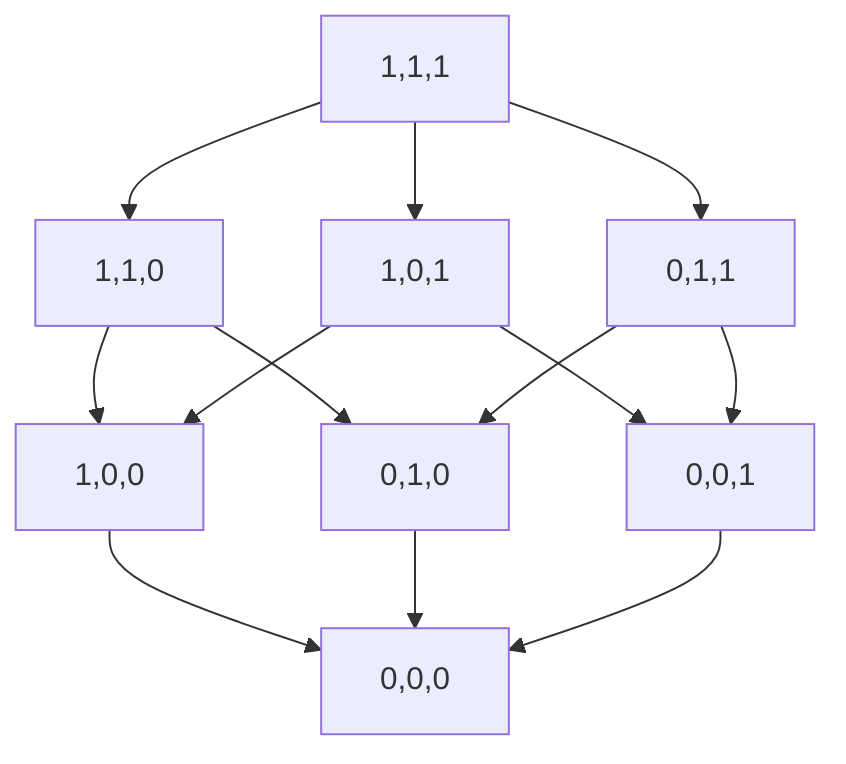

> Покомпонентный порядок. Монотонные функции. Замкнутость класса 𝑀. Лемма о немонотонной функции

# Покомпонентный порядок
**Покомпонентно меньше или равно** ($\preceq$) - $a \preceq b \Leftrightarrow \forall i \in \overline{1..n}: a_i \le b_i$ - отношение порядка (рефлексивно, антисимметрично и транзитивно)

Диаграмма Хассе упорядоченного множества наборов длины 3 по отношению $\preceq$.

# Монотонные функции
**Монотонная функция** (*класс М*) - $f(x_1, x_2, \dots, x_n)$, если $f(\tilde a) \le f(\tilde b)$ для любых $\tilde a \preceq \tilde b$

# Замкнутость класса 𝑀
## Теорема
Класс M замкнут

## Доказательство
Пусть $f(x_1, x_2, \dots, x_n) \in M$ и $g(y_1, y_2, \dots, y_m) \in M$
Рассмотрим $h = f(x_1, x_2, \dots, x_{n-1}, g(x_1, y_2, \dots, y_m), x_{k+1}, \dots, x_n)$
Тогда $h = f(x_1, x_2, \dots, x_{n-1}, y_1, y_2, \dots, y_m) = f(x_1, x_2, \dots, x_{n-1}, g(y_1, y_2, \dots, y_m))$

Возьмём 2 набора значений переменных функции h: $(\alpha^`_1, \alpha^`_2, \dots, \alpha^`_{n-1}, \beta^`_1, \beta^`_2, \dots, \beta^`_m)$ и $(\alpha^{``}_1, \alpha^{``}_2, \dots, \alpha^{``}_{n-1}, \beta^{``}_1, \beta^{``}_2, \dots, \beta^{``}_m)$ такие, что $(\alpha^`_1, \alpha^`_2, \dots, \alpha^`_{n-1}, \beta^`_1, \beta^`_2, \dots, \beta^`_m) \preceq (\alpha^{``}_1, \alpha^{``}_2, \dots, \alpha^{``}_{n-1}, \beta^{``}_1, \beta^{``}_2, \dots, \beta^{``}_m)$

Обозначим $\gamma^` = g(\beta^`_1, \beta^`_2, \dots, \beta^`_m), \gamma^{``} = g(\beta^{``}_1, \beta^{``}_2, \dots, \beta^{``}_m)$

Тогда $y^` \le y^{``}$ и $(\alpha^`_1, \alpha^`_2, \dots, \alpha^`_{n-1}, \gamma^`) \preceq (\alpha^{``}_1, \alpha^{``}_2, \dots, \alpha^{``}_{n-1}, \gamma^{``})$, а раз $f \in M$, $f(\alpha^`_1, \alpha^`_2, \dots, \alpha^`_{n-1}, \gamma^`) \le f(\alpha^{``}_1, \alpha^{``}_2, \dots, \alpha^{``}_{n-1}, \gamma^{``})$

Заметим, что 
$h(\alpha^`_1, \alpha^`_2, \dots, \alpha^`_{n-1}, \beta^`_1, \beta^`_2, \dots, \beta^`_m) = f(\alpha^`_1, \alpha^`_2, \dots, \alpha^`_{n-1}, \gamma^`)$ 
$h(\alpha^{``}_1, \alpha^{``}_2, \dots, \alpha^{``}_{n-1}, \beta^{``}_1, \beta^{``}_2, \dots, \beta^{``}_m) = f(\alpha^{``}_1, \alpha^{``}_2, \dots, \alpha^{``}_{n-1}, \gamma^{``})$

Т.е. $h(\alpha^`_1, \alpha^`_2, \dots, \alpha^`_{n-1}, \beta^`_1, \beta^`_2, \dots, \beta^`_m) \le h(\alpha^{``}_1, \alpha^{``}_2, \dots, \alpha^{``}_{n-1}, \beta^{``}_1, \beta^{``}_2, \dots, \beta^{``}_m)$
Так что $h \in M$

# Лемма о немонотонной функции
## Лемма
Если функция 𝑓 немонотонна, то функция $\bar 𝑥$ является суперпозицией функций f, 0 и 1. То есть если $f \notin M$, то $\bar x \in [\{f, 0, 1\}]$.

## Доказательство
Пусть $f(x_1, x_2, \dots, x_n) \notin M$. Тогда существуют такие наборы значений переменных $\tilde\alpha$ и $\tilde\beta$, что $\tilde\alpha \prec^* \tilde\beta$ (соседние) и $f(\tilde\alpha) > f(\tilde\beta)$ (Т.е. $f(\tilde\alpha) = 1$ и $f(\tilde\beta) = 0$)

Т.к. $\tilde\alpha \prec^* \tilde\beta$, то 
$\tilde\alpha = (\alpha_1, \alpha_2, \dots, \alpha_{k-1}, 0, \alpha_{k+1}, \dots, \alpha_n)$
$\tilde\alpha = (\alpha_1, \alpha_2, \dots, \alpha_{k-1}, 1, \alpha_{k+1}, \dots, \alpha_n)$

Введём функцию $h(x) = f(\alpha_1, \alpha_2, \dots, \alpha_{k-1}, x, \alpha_{k+1}, \dots, \alpha_n)$
$h(0) = (\alpha_1, \alpha_2, \dots, \alpha_{k-1}, 0, \alpha_{k+1}, \dots, \alpha_n) = f(\tilde\alpha) = 1$
$h(1) = (\alpha_1, \alpha_2, \dots, \alpha_{k-1}, 1, \alpha_{k+1}, \dots, \alpha_n) = f(\tilde\alpha) = 0$

Следовательно, $h(x) = \bar x$