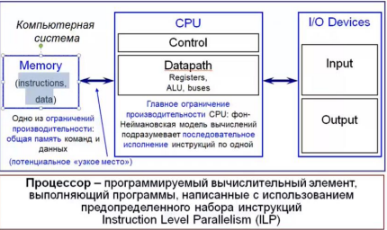

# Фон Неймановская модель компьютера

**Принципы фон Неймана:**

1. **Принцип однородности памяти**
   - В любой ячейке памяти может храниться как элемент данных, так и элемент программы. Нельзя определить тип данных в ячейке по содержимому.

2. **Принцип адресности**
   - Вся память является адресуемой. Нулевая ячейка имеет уникальный адрес.

3. **Принцип программного управления**
   - Ход вычисления определяется программой, сохраненной в памяти.

4. **Принцип двоичного кодирования**
   - Код программы и данные закодированы в двоичном виде.

**Фон Неймановская модель компьютера:**

**Компоненты:**

- **Центральный обрабатывающий блок (CPU):**
  - **Блок управления (Control Unit):** Декодирование инструкций, порядок операций.
  - **Тракт данных (Datapath):** Регистры, арифметико-логическое устройство, шины.

- **Память (Memory):** Хранение инструкций и их операндов.

- **Подсистема ввода/вывода (I/O Devices):** Шина I/O, интерфейсы, устройства.

**Концепция хранения программ:** Инструкции из набора команд выбираются из общей памяти и исполняются последовательно.