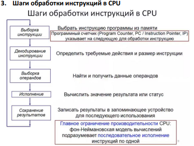

# Шаги обработки инструкций в CPU
1. **Выборка инструкции**
	Выбрать инструкцию программы из памяти. Программный счетчик (Program Counter, PC / Instruction Pointer, IP) указывает на следующую для обработки инструкцию.
2. **Декодирование инструкции**
    Определить требуемые действия и размер инструкции.
3. **Выборка операндов**
    Найти и получить данные операндов.
4. **Исполнение**
    Вычислить значение результата или статус.
5. **Сохранение результата**
    Записать результаты в запоминающее устройство для последующего использования.

