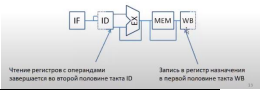
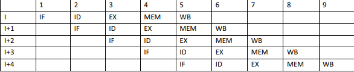

#### Принцип конвейерной обработки инструкций. Определение ступени/стадии конвейера. Ступени конвейера MIPS (пример-иллюстрация).
**Конвейерная обработка инструкций** - метод реализации CPU, при котором множество операции над несколькими инструкциями перекрываются.

- Конвейер, исполняющий инструкцию, состоит из множества шагов, где на каждом завершается этап обработки инструкции. Каждый шаг называется ступенью конвейера или стадией конвейера.
- Ступени и стадии конвейера соединены линейным образом: инструкции входят с одного конца, проходят по ступеням и выходят на другом конце.
- Конвейеризация не сокращает время выполнения отдельной инструкции.

##### Ступени конвейера MIPS
- **IF (Instruction Fetch)** - выборка инструкций.
- **ID (Instruction Decode)** - декодирование инструкции
- **EX (Execution)** - исполнение.
- **MEM (MEMory Access)** - обращение к памяти.
- **WB (Write Back)** - запись рез-та. Имеется в виду запись в регистр.

Число тактов до заполнения = время разгона = число ступеней -1
Время разгона $=4$ такта $\mathrm{CPI}=\frac{9}{5}=1.8$
Идеальное CPI $=1$.
