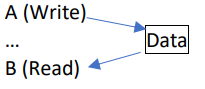
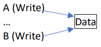
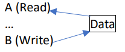

#### Классификация конфликтов данных (RAW/WAW/WAR/RAR).

Пусть А стоит раньше В в потоке инструкций.

- **RAW (Read After Write)** - истинная зависимость по данным.

В пытается читать операнд-источник данных прежде, чем А туда пишет, поэтому В получает неправильное значение (старое).
A (Write)
Data
B (Read) $\star$

- **WAW (Write After Write)** - зависимость по именам регистров.

В пытается записать операнд прежде, чем он записан A, т.е запись происходит в неправильном порядке.

- **WAR (Write After Read)** - зависимость по именам регистров.

В пытается записать результат в приемник прежде, чем он считывается A, поэтому А получает неправильное значение (новое).
A (Read) $\qquad$
B (Write) $\qquad$ Data

- **RAR (Read After Read)** - нет конфликта.
